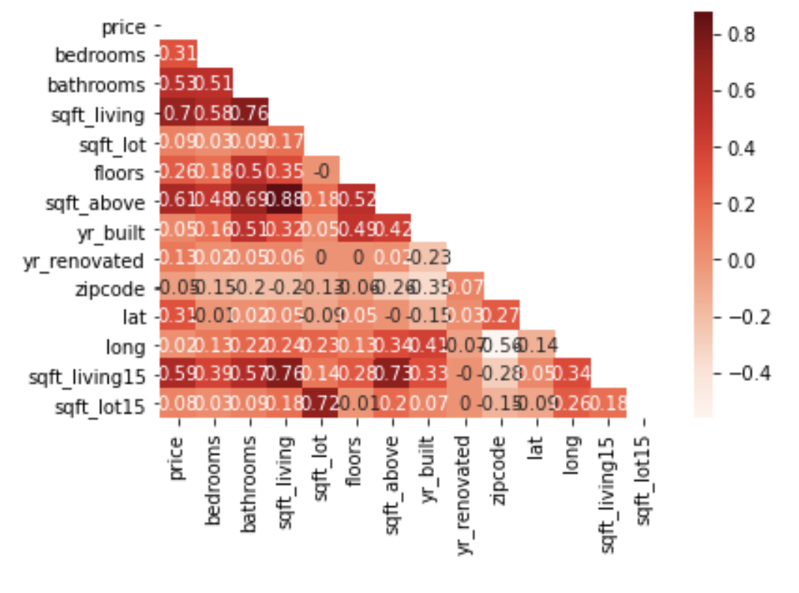
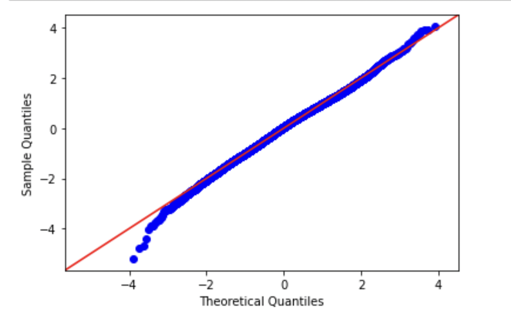

# Phase 2 Project : Kansas City House Data Analysis

Author: Kregg Jackson

## Project Overview

For this project I used multiple linear regression modeling to analyze house sales in Kansas City, Missouri.

## Business Problem

It is up to you to define a stakeholder and business problem appropriate to this dataset.

If you are struggling to define a stakeholder, we recommend you complete a project for a real estate agency that helps homeowners buy and/or sell homes. A business problem you could focus on for this stakeholder is the need to provide advice to homeowners about how home renovations might increase the estimated value of their homes, and by what amount.

## The Data

This project uses the King County House Sales dataset, which can be found in `kc_house_data.csv` in the data folder in this assignment's GitHub repository. The description of the column names can be found in `column_names.md` in the same folder.

## Methods

I used multiple linear regression after testing and cleaning the data. The cleaning process consisted of formatting columns so the model can read the data and dropping predictors that are too correlated. I buit a model with the `price` column as the dependent variable and the highest correlated predictor `sqft_living` then I used a Q-Q plot graph and a scatter plot graph to see if the data in the relationship was distributed normally. After I built a model out of the full cleaned data frame and got a high R-squared but the graphs showed the data still wasn't normally distributed. I built abither model with and replaced the `price` dependent variable with a log of the `price` column and that finally made the data distribute normally.

## Results

### Baseline Model

The baseline model’s high R squared and low p -value showed that there is a relationship between `price` and `sqft_living`. However this model is inconclusive because there is not enough data and sqft_living is too highly correlated with the other predictors  

### First Model

The first model has a high R-squared of 0.891 and low p-values on most of the predictors. Tjis ,odel is also fairly inconclusive because the model's scatter plot is too heteroscedastic and the Q-Q plot shows that the data is still not normally distributed.

### Final Model

On the final model the R-squared score dropped to 0.650 but almost all the predictors have a low p-value. The Q-Q plot shows the model is normally distributed and the scatter plot shows the data is heteroscedastic. 

## Conclusions

* Based on the coefficients of the final version of my model the `waterfront_YES`  column has the strongest positive impact on price 
* The coefficient is 0.3189 which means if the house is waterfront property the price should be 31.89% higher than if it was not waterfront 
* The `grade` column was the second highest, if the grade goes up a point the house value increases by 20.47% 
* The `bathrooms` column was the highest correlated column that could be practically renovated, adding a bathroom could increase house value by 9.5% 

### Next Steps

Additional analysis could provide further insights into how to improve likelihood of renovation success.

Too many columns deal with factors that can’t be changed I would suggest building a regression model only out of columns with data that can be renovated. If I had more time I would also remove outliers to reduce error and get a more homoscedadtic model.
## For More Information
See the full anaysis in the [Jupyter Notebook](https://github.com/kreggthegoat/dsc-phase-2-project) or review the [presentation](https://docs.google.com/presentation/d/1Mva7ee4uyrx2nWA2A2BdbvN_z8NEzxPM5doaBZ0TjTk/edit?usp=sharing).

## Thank You