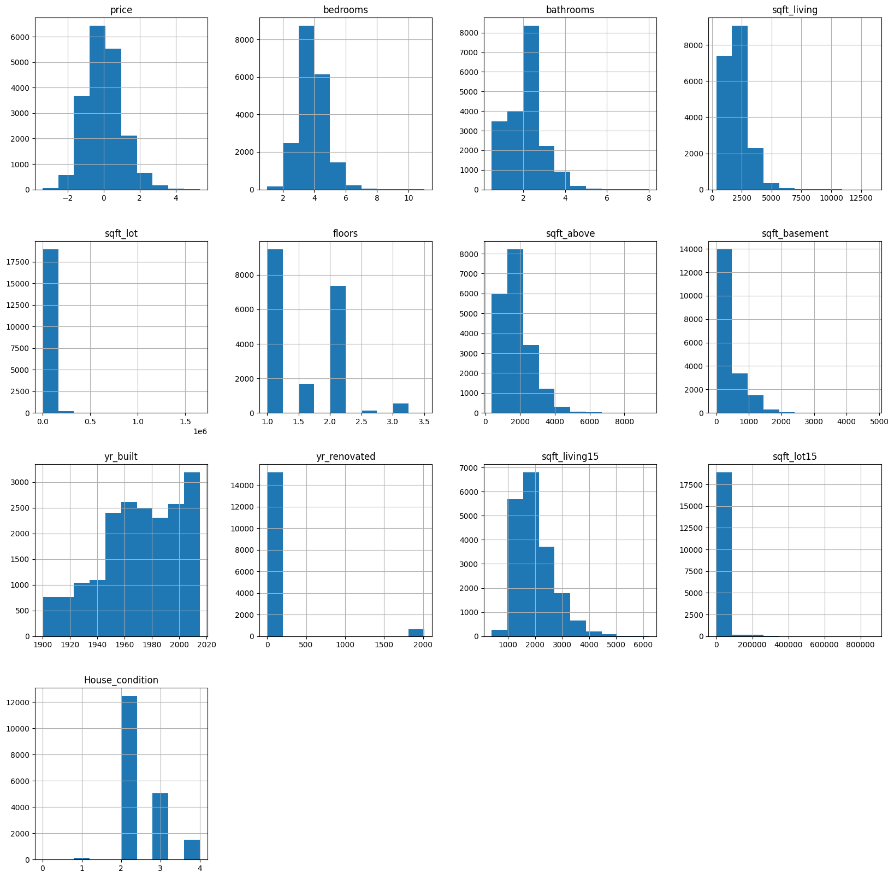
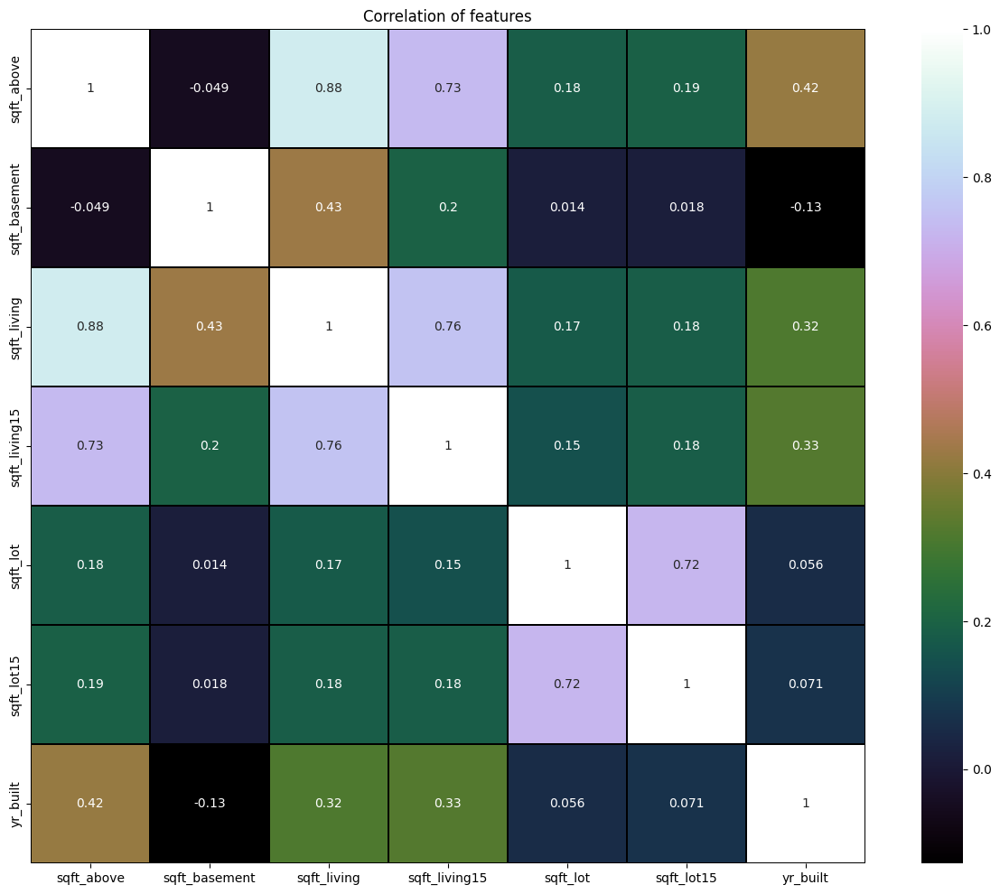
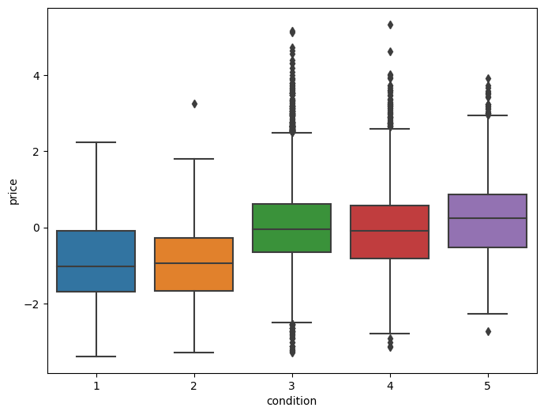

## NON-TECHNICAL PRESENTATION
## KING COUNTY HOUSING PROJECT
## GROUP MEMBERS
1.ALLEN MAINA
2.CYNTHIA KAREKO
3.CELIAJOY OMIAH
4.MARION JELIMO
5.WILLIAM OMBALLA

 

## OVERVIEW
# BACKGROUND INFORMATION

King County is located in Washington, USA. It is widely recognized as the most populous county in the state. The County found in the western part of Washington, includes the city of Seattle with two-thirds of the county's 2.3 million residents living in the suburbs. The dataset used for this analysis comprises administrative data on over 21,000 house sales that occurred between May 2014 and May 2015. The data contains homes with different features including prices, the number of bedrooms, and the year of construction including the conditions of the homes. In King County, Washington, a diverse range of houses sold, cater to various preferences, needs, and budgets. The housing market includes single-family homes, townhouses, condominiums, and apartments. Single-family homes vary widely, from historic houses with unique architectural features to modern, energy-efficient properties. Townhouses and condominiums are popular options, especially in urban areas like Seattle, offering a mix of affordability and convenience. The clientele in King County is diverse including first-time homebuyers, families seeking spacious homes in suburban neighborhoods, young professionals looking for urban condominiums, and retirees searching for comfortable and low-maintenance options. Additionally, King County attracts a significant number of tech professionals due to the presence of tech giants like Microsoft and Amazon, influencing the market with a demand for upscale, modern homes.

The housing ecosystem faces various challenges. Housing affordability is one of the challenges. The cost of housing in King County, particularly in areas like Seattle, has surged significantly, making it difficult for many residents, especially low and middle-income families, to afford homes. Access to affordable housing options has now become a pressing concern due to the increased cost of living. Shortage of housing units available is also a major challenge, this leads to intense competition among buyers. The housing supply has struggled to keep up with the growing demand, resulting in rising property prices. King County experiences heavy traffic congestion, especially in urban areas, influencing commutes and accessibility. Climate change is also a major challenge, such as rising sea levels and extreme weather events, which can influence waterfront properties and require careful consideration in real estate planning and development.
The challenges stated can be solved in so many ways including proper urban planning where the government invests in good infrastructure and creates systems like proper public transportation that improve connectivity between residential areas and employment centers. The government can also initiate programs that offer subsidies, partnerships with developers, and tax credits that provide incentives that increase the supply of affordable housing. Increasing the housing supply can be achieved by permitting processes and zoning regulations to facilitate the construction of new housing units encouraging mixed-use developments and exploring options for affordable housing on public land. Climate change can be solved by promoting green building practices by protecting natural habitats, incorporating green spaces within urban areas, and implementing climate-resilient design standards.

# PROBLEM STATEMENT

The Real Estate Agency needs to offer effective guidance for prospective home sellers seeking to enhance their property's value before listing it on the market. Specifically, there is a demand for personalized recommendations concerning improvements to specific features within homes. Additionally, there is a lack of information regarding the expected increase in property value associated with these enhancements.

# OBJECTIVES
The objectives of the analysis on house sales in King County are as follows:
•	To identify features that are highly related to price
•	Find the relationship between th house area/sizes and the price
•	Analyse how the price relates to the condition and grade
•	Find the relationship between price and home features e.g: Bedrooms, bathrooms etc.
•	To identify the relationship between price and location

These objectives purpose to use data analysis and linear regression modeling to benefit both homeowners and the real estate agency by providing actionable insights and recommendations for investment decisions.

## DATA UNDERSTANDING
The dataset used in this analysis is the King County House Sales dataset, sourced from Kaggle. It contains information about house sales in King County, including various features related to the properties and their sale prices. It comprises administrative data on over 21,000 house sales that occurred between May 2014 and May 2015. The data contains homes with different features which include prices, the number of bedrooms, the year the homes were built including the conditions of the homes.
The dataset comprises 21597 rows and 21 columns. The columns come with descriptions found in separate column names datasets to help better understand the features.
The data types in the dataset include integer, float, and object.

# Data Preparation
This section involves getting the data ready for analysis and modeling.
We started by inspecting the dataset to gain an understanding of its structure and content
Preparation of the data involved;
•	Handling missing values by filling in missing data points or removing rows/columns with missing values. Missing values can be problematic because they can lead to biased or inaccurate results when performing data analysis or training machine learning models
•	Removing duplicates where we eliminate duplicate records to maintain data integrity.
•	Correcting inaccuracies by identifying and correcting errors or inconsistencies in the data. Inaccurate data can lead to incorrect analysis and predictions. 
•	Handling outliers by analyzing and deciding whether to remove or transform outliers based on the context of the analysis. Outliers are data points that deviate significantly from the majority of the data. They can distort statistical measures and affect the model's generalization.
•	Dealing with the categorical values in our dataset and whether they require One-Hot encoding. Machine learning models typically work with numeric data, so categorical variables need to be transformed into a numeric format. One-hot encoding is a common technique to convert categorical variables into a format that can be used in machine learning models. This ensures that the model can make sense of categorical data.
•	Identifying the columns relevant to our problem. The irrelevant or redundant columns I.e.,  view, lat, long, yr_renovated were dropped. By dropping these columns, we aim to streamline our analysis and modeling efforts toward variables that are directly relevant to the estimation of home value.
•	Converting data types to ensure that data types are consistent with the intended analysis by converting data to the appropriate data types (e.g., dates, units, integers, strings) and standardizing data formats to ensure that data is consistently formatted (e.g., date formats)

## DATA ANALYSIS: MODELING AND REGRESSION RESULTS DISCUSSION

Multiple linear regression statistical technique was utilized to model the relationship between prices, our target variable, and various house features for the purpose of predicting and explaining the behavior of the house prices based on these features.
To attain our first objective, identifying the feature that is most highly correlated with price, the dependent variable was the price, and the independent variables were house features that were influencing the pricing of the houses, which were house condition, absence or presence of a waterfront view, house area, and year of construction.
Additionally, to provide information/insight on the expected increase in property value with regard to enhancing the above house features, we sought to establish a relationship between houses

This graph shows the distribution of the data we have.

This plot explores the correlation between different features in our dataset.

This plot shows how condition and price are related.

## RECOMMENDATIONS
Based on the findings from our multiple linear regression analysis, we recommend that homeowners consider the following strategies for potentially increasing the estimated value of their homes:

1. Expand Square Footage with Strategic Considerations: For homeowners considering expanding the square footage of their property, it is crucial to strategically plan the extension to ensure a seamless integration with the existing structure. Focus on creating functional and versatile spaces that align with the needs and preferences of potential buyers. Additionally, pay attention to optimizing the flow and overall layout of the expanded space to enhance the overall appeal and usability of the property.

2. Emphasize Quality Construction in Renovation Projects: When undertaking construction or renovation projects, prioritize the use of high-quality materials and ensure adherence to superior construction standards. Emphasizing durability, energy efficiency, and modern design aesthetics can significantly contribute to the perceived value of the property. Engaging reputable contractors and adhering to industry best practices can help ensure that the construction work adds substantial value to the property.

3. Explore the Impact of Additional Features on Property Value: Beyond square footage and bathrooms, consider the potential impact of additional features such as outdoor amenities, energy-efficient installations, and smart home technology. Conducting further analysis to understand the preferences and priorities of the target market can provide valuable insights into which features are most likely to enhance the property's appeal and value. Integrating sought-after features that align with current market trends can position the property competitively within the real estate market.

4. Validate Model Assumptions with Additional Data: Given the constraints of the current model, it is essential to validate the assumptions and limitations by incorporating additional data from diverse geographical locations and housing markets. This process can help assess the model's robustness and applicability beyond the specific context of King County. Moreover, considering alternative modeling techniques and exploring advanced regression methodologies can offer a more comprehensive understanding of the housing market dynamics across different regions.

5. Account for Outliers in Predictive Analyses: In future analyses, it is advisable to handle outliers in the dataset with caution, considering their potential impact on the predictive accuracy of the model. Implementing robust techniques for outlier detection and handling can help improve the model's performance and ensure more reliable predictions, especially for properties with unique or exceptional characteristics. Regularly reassessing and updating the model with new data that reflects a diverse range of property values can enhance its predictive capabilities and relevance over time.

