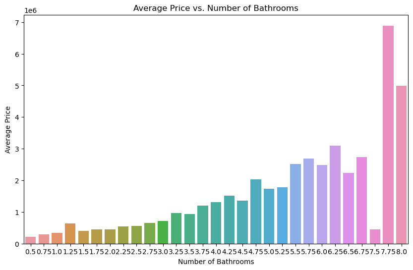

# Phase 2 Project - Prediction of House Prices in King County, WA

## Overview

Through this project, we are setting out on a mission to provide homeowners with a thorough awareness of the factors that influence housing pricing. This initiative is a joint venture with our shareholder, a well-known real estate company committed to helping homeowners navigate the complex home-buying and selling process.

  

## Business Understanding

Many people want to buy properties in the vibrant King County, Washington, real estate market. Unfortunately, these prospective customers frequently have to navigate the market in blindness due to the constant information asymmetry. Our goal is to provide a reliable approach for estimating home values so that potential buyers can make educated decisions about their real estate investments. We will do this by providing priceless advisory services to a respectable real estate company that supports families in their quest of homeownership.

### Problem Statement

In the ever-changing King County, Washington, real estate market, potential purchasers frequently encounter difficulties in trying to comprehend the many aspects that influence residential property values. Due to this knowledge gap, homeowners and prospective purchasers may find it difficult to navigate the housing market without a thorough understanding of the major factors that affect property values. People thus find it difficult to make wise choices while purchasing, disposing of, or making investments in real estate.

### Objectives

Our primary objective is to find out how independent factors affect a home's pricing.

1. To evaluate the correlations between independent variables and house prices are the specific objectives.
2. To Examine How Differently Correlated Variables Affect Home Prices.
3. To Create a Sturdy Multilinear Regression Model for Forecasting Home Prices.

## Data Understanding

One dataset was provided and used for this analysis.

The process of data understanding begins with describing the raw dataset - through the help of pandas - by:

- Mentioning the shape of the dataframe (_21507 rows_ and _21 columns_).
- Viewing the data types of the columns, as well as the columns that may have null values (`yr_renovated`, `waterfront` and `view`).
- Generating descriptive statistics for all the columns.
- Understanding what columns could have erroneous/duplicate/null values and formulating a way to deal with them.

## Data Preparation

To clean the dataframe, removal of erroneous and null data as well as handling of duplicate data was done.

Initally, the columns that were deemed surplus to requirements were dropped. These columns are: `date` and `yr_renovated`. An important point of clarification is that **other columns can be dropped at a later stage if deemed necessary**.

Furthermore, records will null values were dropped as well, before converting string-based columns to equivalent integers for easier analysis. Among the columns that were replaced were the `condition` and `waterfront` columns, before splitting the values in the `grade` column to comprise only of numerical ratings rather than a mixture of integers and text.

Lastly, it was noted that in the `sqft_basement` column, 415 records were using a question mark as a placeholder value. As we do not know what the appropriate values for the records with the placeholder value would be, and any attempt at replacing the values would distort the study, these records were dropped.

## Modeling

### EDA

A positively skewed distribution was noticed when looking at the distribution of prices in the dataset.

  

The other columns were then copmarede to the price as seen in the figure below. Some variables, such as `bedrooms` and `floors` were noted to be discrete variables while others were continuous.

  

#### 1.Impact of Grade of a House on Pricing

A general trend noted is that the price of a house tends to increase with an increase in the grade rating. The boxplot below depicts this clearly, as well as giving added information such as the median and outliers.

  

#### 2.Impact of the Number of Bathrooms on a House's Pricing

Generally, an increase in the number of bathrooms in a house leads to an increase in house price. There are some anomalies, however, with houses with 1.25 bathrooms having higher average prices as compared to houses with 1.5-3.0 bathrooms. There is also a sharp drop in average cost for houses with 7.5 bathrooms as compared to 6.75 bathrooms, with an even sharper climb being noted for houses with 7.75 bathrooms.

  

#### 3.Relation of Price with Other Variables

The correlation factors vis-a-vis the price were looked at for all the other variables and price are summarised as follows, in descending order:

| variable          | factor   |
| ----------------- | -------- |
| 1. sqft_living    | .704892  |
| 2. grade          | .667827  |
| 3. sqft_above     | .609441  |
| 4. sqft_living15  | .582869  |
| 5. bathrooms      | .526509  |
| 6. view_EXCELLENT | .310087  |
| 7. bedrooms       | .309573  |
| 8. lat            | .305096  |
| 9. waterfront     | .273248  |
| 10. floors        | .258151  |
| 11. view_GOOD     | .181053  |
| 12. view_FAIR     | .091643  |
| 13. sqft_lot      | .086709  |
| 14. sqft_lot15    | .082021  |
| 15. yr_built      | .053359  |
| 16. condition     | .035723  |
| 17. long          | .021343  |
| 18. id            | -.018544 |
| 19. zipcode       | -.049316 |
| 20. view_NONE     | -.358042 |

### Baseline Model

The dependent variable (y_baseline) in our model reflects the goal variable we wish to forecast, which is the price of homes. The predictor variable is the independent variable (x_baseline), namely the square footage of living space within the dwellings. This model's purpose is to build a linear connection between'sqft_living' and 'price' by estimating the coefficients (slope and intercept) that characterize how changes in'sqft_living' correspond to changes in 'price.' These coefficients reveal information about the strength and direction of the association.

The Baseline Model forecasts housing prices ('price') using'sqft_living'. The main conclusions are as follows:

- **R-squared**: The size of a living area accounts for approximately 49.7% of price fluctuation.
- **Coefficients**: The price goes up by around $284.26 per square foot.
- **MAE**: There is potential for improvement since the average prediction error is $175,229.76.
- **Significance of the Model**: The model possesses statistical significance.
- **Condition Number**: Indicates possible problems with multicollinearity.

In conclusion, the Baseline Model, which explains roughly half of price fluctuation, is a solid place to start. Although statistically significant, it may be made better by taking multicollinearity into account.

### Multiple Linear Regression Model

A powerful statistical technique for estimating home values is the Multiple Linear Regression Model, which takes into account a number of independent factors like the number of bedrooms, baths, square footage, lot size, floors, waterfront location, grade, and condition. It gives crucial information about the complex relationship between these characteristics and home prices, empowering all parties involved to make better decisions about pricing, investing, and understanding the behavior of the housing market in the real estate sector.

In summary, this Multiple Linear Regression Model is robust and highly significant:

- **R-squared**: It explains about 70.3% of house price variation, indicating a strong relationship between predictors and prices.
- **Adjusted R-squared**: This value (0.702) suggests a well-fitted model without overfitting.
- **F-statistic**: The high F-statistic (2309) underscores the model's strong explanatory power.
- **Coefficients**: Features like 'bathrooms,' 'sqft_living,' 'floors,' 'waterfront,' 'condition,' and 'grade' positively impact prices, while 'bedrooms' has a negative effect.
- **Intercept**: The intercept isn't practically significant, representing the price when all other predictors are zero.
- **MAE**: The model's Mean Absolute Error (MAE) is approximately 127,176.67, indicating reasonably accurate predictions.
- **Multicollinearity**: There may be multicollinearity concerns that require further investigation.

The lowest eigenvalue in the Multiple Linear Regression Model indicates the presence of substantial multicollinearity or design matrix problems, which call for more research. Despite this, the model shows strength in explaining a considerable amount of the variation in housing prices, mostly due to a variety of factors that have a positive or negative influence on prices. Model dependability requires awareness of possible multicollinearity, but it may also be enhanced by lowering the Mean Absolute Error (MAE) through feature selection optimization and model refining. Finally, even if there are still certain areas that might be improved and refined, this model provides insightful information for wise real estate selections.

### Multicollinearity

### VIF

## Evaluation
